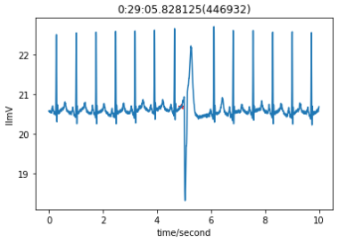



## aws 마이그레이션 

#### 주제 : 심전도 측정 데이터를 이용하여 오전송인지 분류해주는 프로젝트 

#### 사용기술
    - DB : RDS, s3
    - api : rest
    - log : cloudwatch
    - instace : basic - ml.52.large 
                training - ml.p3.2xlarge
                deploy - ml.c5.large
 
1. seers api 를 통하여 data 수신 및 저장 (s3 bucket)
2. 수신 데이터를 이용하여 학습데이터 생성 (wfdb library)
3. preprocessing and training (tensorflow)
4. test and model deploy 
5. 예측할 수신 데이터 전처리 -> wfdb 라이브러리 사용 10초 단위로 학습데이터 변경

 

6. inference 진행 
7. 결과 DB 에 저장 (RDS)

 