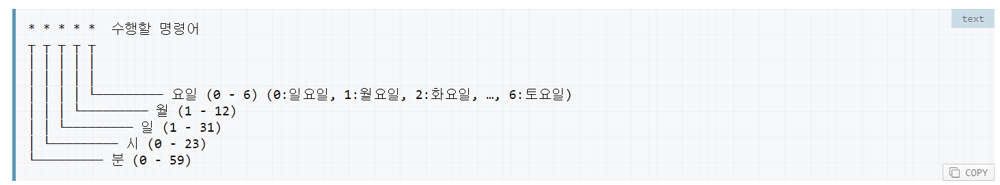

# airflow 사용

airflow/dags 안에 dag를 정의하여 사용

Celery executor 를 사용하려면 worker 를 실행시켜야함 

Schedule interval 은 cron 형태 or 파이썬 Datetime library 형태 

Operator 를 객체 생성하면 task가 생성
기본적으로 operator 객체 즉 task를 생성하면 DAG 정의할 때 사용한 argument 를 상속받음 task 생성할 때 override 가능

airflow 성공 여부 slack으로 알람받기
[slack for airflow](https://burning-dba.tistory.com/102)

-------------------

args 
- depends_on_past: when set to True, keeps a task from getting triggered if the previous schedule for the task hasn’t succeeded

- wait_fow_downstream: when set to true, an instance of task X will wait for tasks immediately downstream of the previous instance of task X to finish successfully before it runs.

- retries (int) – the number of retries that should be performed before failing the task

- catchup - backfill 할건지 True 로 하면 backfill 안하는거임 
 
------------------
***주의***

2020-02-12

airflow 에서 bash_operator 명령을 할때 즉 command 명령을 실행할때
맨 마지막을 공백으로 남겨두는것 주의하기 
jinja 랑 충돌날 수 있음

쉘을 실행할때 기본 경로는 tmp 쪽에 있음 그러니 경로설정 주의 

   
~airflow 를 테스트 할 땐 정상 작동하는데 직접 실행 시키면
자격증명 오류가 뜸 Iam role을 ec2에 적용시켯는데 airflow를 쓰려면
다른 조치가 필요 ???
해결~

test 방법

airflow test dag명 task명 날짜

-------------------

2020-02-13

~airflow worker 쪽에 mingle 문제 발생 
메모리부족 ??
무슨 문제일까 실행하는데는 문제 없었음~ 

실행 안되는건 날짜 문제도 확인해봐야할듯

schedule_interval 같은건 arg 에서 설정 x dag 내의 인자로 넘겨줘야
적용됨

